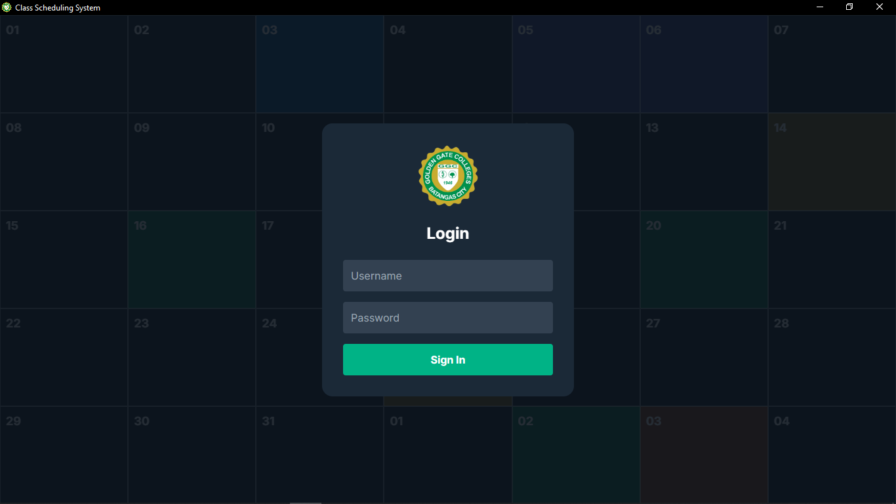
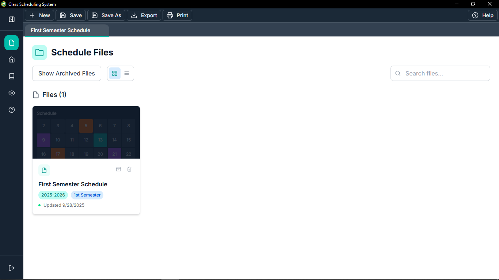
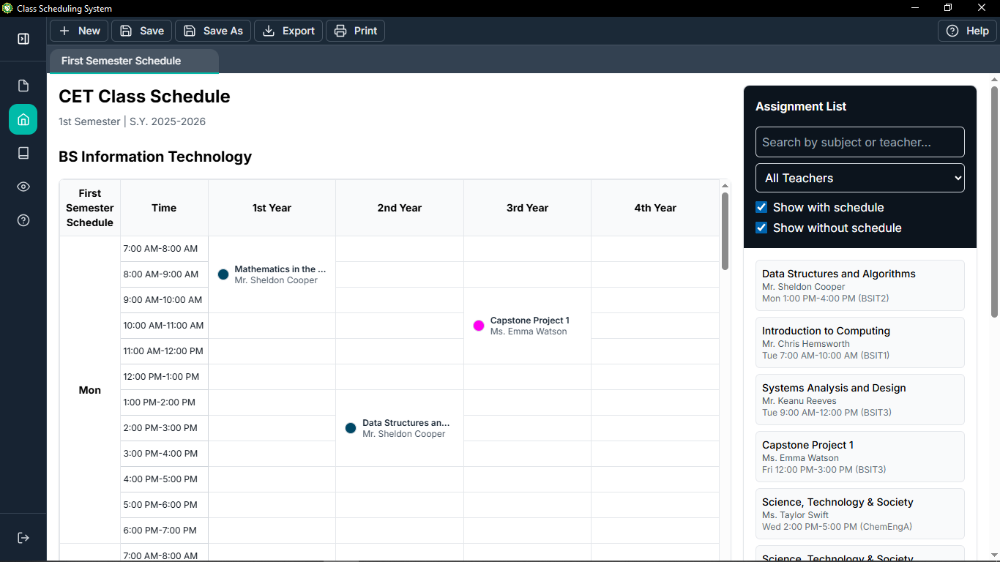
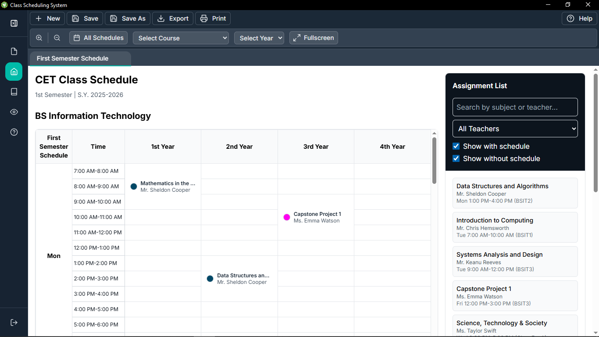
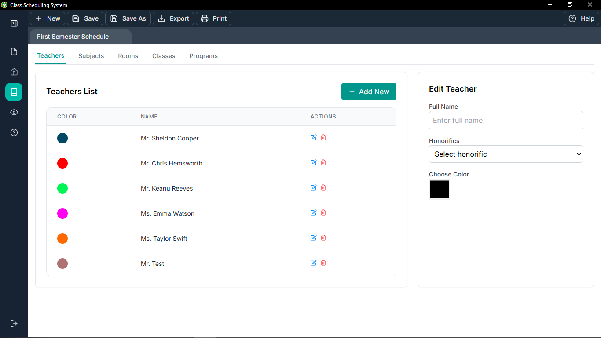
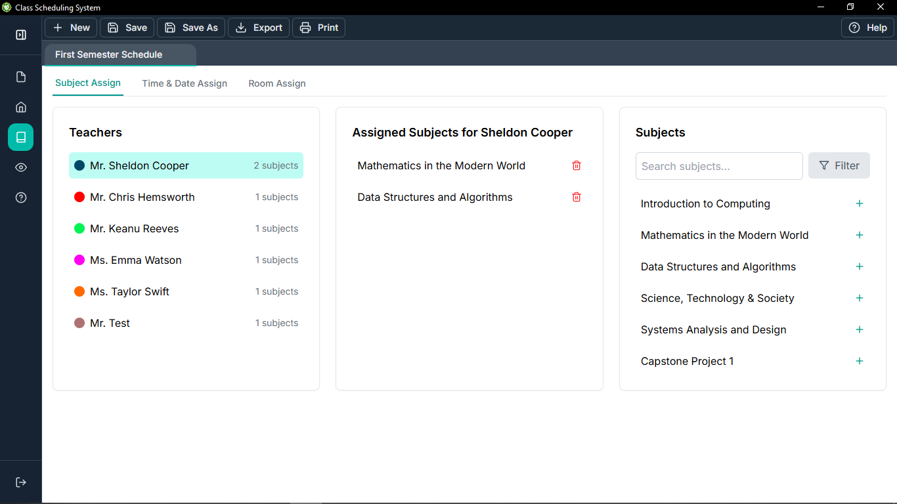

# Class Scheduling System

A desktop-based **Class Scheduling System** for **Golden Gate Colleges**, developed as a capstone project.  
The system streamlines scheduling by reducing manual work, preventing conflicts, and ensuring timely release of schedules.

---

## 📚 Table of Contents
- [Features](#-features)
- [Screenshots](#-screenshots)
- [Setup Instructions](#-setup-instructions)
- [Database Setup](#-database-setup-sqlite3)
- [Shortcut Keys](#-shortcut-keys)
- [Help & Documentation](#-help--documentation)
- [About](#-about)
- [License](#-license)

---

## ✨ Features
- 🔑 **Authentication** – Secure login for users.
- 📊 **Scheduling** – Automated scheduling with conflict detection.
- 🏫 **Multi-Program Support** – Manage schedules across multiple departments.
- ⚡ **Real-Time Updates** – Instantly see changes when assigning faculty or rooms.
- 🎨 **Modern UI** – Built with **React + Tailwind**.
- 💾 **Local Database** – Data stored in **SQLite3** for fast, offline access.
- 📂 **File Management** – Create, save, export, and print schedules.

---

## 📸 Screenshots

<div style="display: grid; grid-template-columns: repeat(auto-fit, minmax(250px, 1fr)); gap: 16px;">

  <div>
    <h4>Login</h4>
    
  </div>

  <div>
    <h4>File</h4>
    
  </div>

  <div>
    <h4>Home</h4>
    
  </div>

  <div>
    <h4>View Tools Enabled</h4>
    
  </div>

  <div>
    <h4>Manage Data</h4>
    
  </div>

  <div>
    <h4>Assigning</h4>
    
  </div>

</div>

---

## ⚙️ Setup Instructions

```bash
# 1. Clone the repository
git clone https://github.com/johndexter268/my-app.git
cd my-app

# 2. Install dependencies
npm install

# 3. Run in development mode
npm run dev

# 4. Run with Electron
npm run electron:dev

# 5. Build for production
npm run build
npm run electron:build
```

---

## 🗄️ Database Setup (SQLite3)
- The database (`database.sqlite`) is auto-generated on first run.
- Use `/db/schema.sql` for schema initialization.

---

## ⌨️ Shortcut Keys

### Main Actions
| Action | Shortcut |
|--------|-----------|
| New File | Ctrl+N |
| Save | Ctrl+S |
| Save As | Ctrl+Shift+S |
| Export | Ctrl+E |
| Print | Ctrl+P |
| Help | Ctrl+H |
| Close File | Ctrl+W |

### Navigation
| Action | Shortcut |
|--------|-----------|
| File Page | Ctrl+1 |
| Home Page | Ctrl+2 |
| Manage Data (Scheduling) | Ctrl+3 |
| Assigning (Scheduling) | Ctrl+4 |
| Toggle View Tools | Ctrl+5 |
| Help Page | Ctrl+H |
| Logout / Login Page | Ctrl+L |
| Toggle Sidebar | Ctrl+B |

### View Tools
| Action | Shortcut |
|--------|-----------|
| Zoom In | Ctrl++ / Ctrl+= |
| Zoom Out | Ctrl+- |
| Full Screen | Ctrl+F / F11 |

### General
| Action | Shortcut |
|--------|-----------|
| Close Modal | Escape |

*(More detailed shortcuts available in the in-app **Help** section.)*

---

## 📖 Help & Documentation
- Built-in **Help tab** with:
  - User Guide (PDF)
  - Shortcut Keys & Commands
  - About section with developer details

---

## ℹ️ About
Golden Gate Colleges, established in **1946**, is the first private higher education institution in Batangas.  
This project aims to replace manual scheduling (Word/Excel) with an automated system, reducing workload and minimizing conflicts, especially in the **Engineering and Technology Department**.

---

## 📜 License
This project is licensed under the **MIT License**.  
